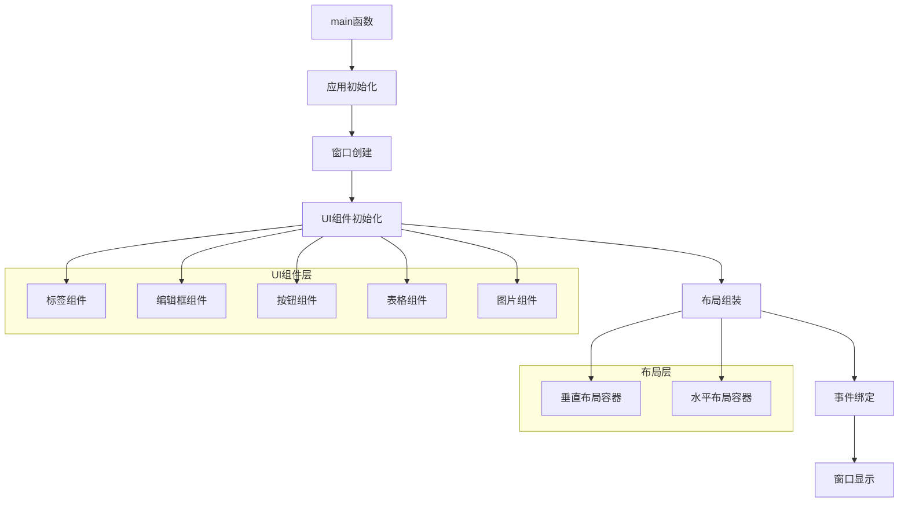
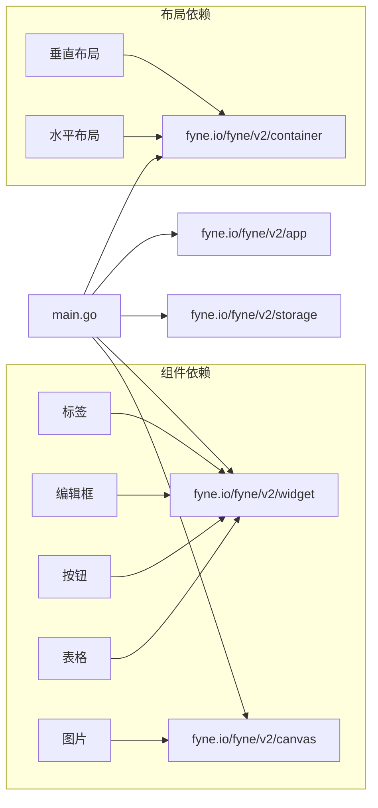
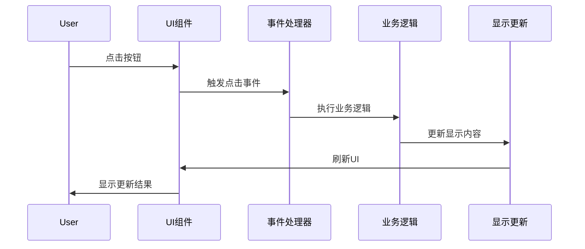

# Fyne窗口程序开发 - 架构设计文档

## 整体架构图



## 分层设计和核心组件

### 应用层 (Application Layer)
- **主函数**: 程序入口点，负责应用初始化和启动
- **应用实例**: Fyne应用对象，管理应用生命周期

### 窗口层 (Window Layer)
- **窗口对象**: 主窗口，负责窗口管理和显示
- **窗口配置**: 设置窗口标题、大小等属性

### UI组件层 (UI Component Layer)
- **标签组件**: 显示静态文本信息
- **编辑框组件**: 接收用户文本输入
- **按钮组件**: 响应用户点击事件
- **表格组件**: 显示结构化数据
- **图片组件**: 显示图片内容

### 布局层 (Layout Layer)
- **垂直布局容器**: 主要布局容器，垂直排列组件
- **水平布局容器**: 辅助布局容器，水平排列组件

### 事件层 (Event Layer)
- **事件处理器**: 处理按钮点击等用户交互事件
- **回调函数**: 响应特定事件的函数

## 模块依赖关系图



## 接口契约定义

### 主程序接口
```go
func main()
```
- 功能: 程序入口点
- 输入: 无
- 输出: 无
- 副作用: 创建并显示GUI应用

### 窗口创建接口
```go
func createWindow(app fyne.App) fyne.Window
```
- 功能: 创建主窗口
- 输入: fyne.App应用实例
- 输出: fyne.Window窗口实例
- 副作用: 无

### UI组件创建接口
```go
func createLabel() *widget.Label
func createEntry() *widget.Entry
func createButton() *widget.Button
func createTable() *widget.Table
func createImage() *canvas.Image
```
- 功能: 创建各种UI组件
- 输入: 无
- 输出: 对应的组件实例
- 副作用: 无

### 布局组装接口
```go
func setupLayout(content ...fyne.CanvasObject) fyne.CanvasObject
```
- 功能: 组装UI布局
- 输入: UI组件列表
- 输出: 布局容器对象
- 副作用: 无

### 事件处理接口
```go
func setupButtonEvents(button *widget.Button, entry *widget.Entry, label *widget.Label)
```
- 功能: 设置按钮事件处理
- 输入: 按钮实例、编辑框实例、标签实例
- 输出: 无
- 副作用: 修改组件行为

## 数据流向图



## 异常处理策略

### 编译时异常
- **依赖缺失**: 确保所有必要的依赖已正确安装
- **语法错误**: 遵循Go语言语法规范
- **类型错误**: 确保类型匹配和转换正确

### 运行时异常
- **资源加载失败**: 提供默认资源或错误提示
- **窗口创建失败**: 记录错误日志并优雅退出
- **组件初始化失败**: 提供错误反馈

### 用户输入异常
- **无效输入**: 提供输入验证和错误提示
- **空输入**: 提供默认值或提示用户输入

## 设计原则

1. **简单性**: 保持代码简单易懂，避免过度设计
2. **可读性**: 使用清晰的命名和完整的注释
3. **可维护性**: 模块化设计，便于后续扩展
4. **一致性**: 遵循Go语言和Fyne框架的编码规范
5. **可测试性**: 设计可测试的函数和组件

## 性能考虑

1. **资源管理**: 合理管理图片等资源，避免内存泄漏
2. **渲染优化**: 避免不必要的UI重绘
3. **响应性**: 确保UI响应及时，避免阻塞

## 安全考虑

1. **输入验证**: 验证用户输入，防止注入攻击
2. **资源安全**: 安全加载外部资源，防止路径遍历
3. **错误处理**: 安全处理错误，避免信息泄露