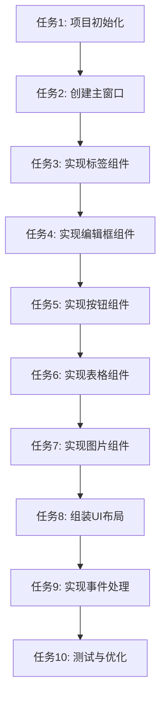

# Fyne窗口程序开发 - 任务拆分文档

## 任务依赖图

## 原子任务列表

### 任务1: 项目初始化
- **ID**: T001
- **描述**: 初始化Go项目，安装Fyne依赖，创建基本项目结构
- **输入契约**:
  - 前置依赖: 无
  - 输入数据: 无
  - 环境依赖: Go 1.17+环境
- **输出契约**:
  - 输出数据: go.mod文件，基本项目结构
  - 交付物: 初始化的项目
  - 验收标准: go mod tidy成功执行，项目结构正确
- **实现约束**:
  - 技术栈: Go modules
  - 接口规范: 标准Go模块结构
  - 质量要求: 正确设置模块路径
- **依赖关系**:
  - 后置任务: 任务2
  - 并行任务: 无

### 任务2: 创建主窗口
- **ID**: T002
- **描述**: 创建Fyne应用程序和主窗口，设置基本属性
- **输入契约**:
  - 前置依赖: 任务1
  - 输入数据: 无
  - 环境依赖: Fyne库已安装
- **输出契约**:
  - 输出数据: main.go文件中的main函数和窗口创建代码
  - 交付物: 可运行的主窗口
  - 验收标准: 程序可编译运行，显示空白窗口
- **实现约束**:
  - 技术栈: Fyne v2
  - 接口规范: Fyne应用和窗口API
  - 质量要求: 窗口标题正确设置
- **依赖关系**:
  - 后置任务: 任务3
  - 并行任务: 无

### 任务3: 实现标签组件
- **ID**: T003
- **描述**: 创建标签组件并添加到窗口中
- **输入契约**:
  - 前置依赖: 任务2
  - 输入数据: 标签文本内容
  - 环境依赖: Fyne库
- **输出契约**:
  - 输出数据: 标签组件代码
  - 交付物: 显示文本的标签组件
  - 验收标准: 标签正确显示指定文本
- **实现约束**:
  - 技术栈: Fyne widget.Label
  - 接口规范: Fyne标签API
  - 质量要求: 文本清晰可读
- **依赖关系**:
  - 后置任务: 任务4
  - 并行任务: 无

### 任务4: 实现编辑框组件
- **ID**: T004
- **描述**: 创建编辑框组件并添加到窗口中
- **输入契约**:
  - 前置依赖: 任务3
  - 输入数据: 无
  - 环境依赖: Fyne库
- **输出契约**:
  - 输出数据: 编辑框组件代码
  - 交付物: 可输入文本的编辑框组件
  - 验收标准: 编辑框可接收用户输入
- **实现约束**:
  - 技术栈: Fyne widget.Entry
  - 接口规范: Fyne编辑框API
  - 质量要求: 输入响应及时
- **依赖关系**:
  - 后置任务: 任务5
  - 并行任务: 无

### 任务5: 实现按钮组件
- **ID**: T005
- **描述**: 创建按钮组件并添加到窗口中
- **输入契约**:
  - 前置依赖: 任务4
  - 输入数据: 按钮文本
  - 环境依赖: Fyne库
- **输出契约**:
  - 输出数据: 按钮组件代码
  - 交付物: 可点击的按钮组件
  - 验收标准: 按钮正确显示文本，可点击
- **实现约束**:
  - 技术栈: Fyne widget.Button
  - 接口规范: Fyne按钮API
  - 质量要求: 点击响应正确
- **依赖关系**:
  - 后置任务: 任务6
  - 并行任务: 无

### 任务6: 实现表格组件
- **ID**: T006
- **描述**: 创建表格组件并添加到窗口中，填充示例数据
- **输入契约**:
  - 前置依赖: 任务5
  - 输入数据: 示例表格数据
  - 环境依赖: Fyne库
- **输出契约**:
  - 输出数据: 表格组件代码
  - 交付物: 显示数据的表格组件
  - 验收标准: 表格正确显示示例数据
- **实现约束**:
  - 技术栈: Fyne widget.Table
  - 接口规范: Fyne表格API
  - 质量要求: 数据显示清晰，布局合理
- **依赖关系**:
  - 后置任务: 任务7
  - 并行任务: 无

### 任务7: 实现图片组件
- **ID**: T007
- **描述**: 创建图片组件并添加到窗口中，加载示例图片
- **输入契约**:
  - 前置依赖: 任务6
  - 输入数据: 示例图片文件
  - 环境依赖: Fyne库
- **输出契约**:
  - 输出数据: 图片组件代码
  - 交付物: 显示图片的图片组件
  - 验收标准: 图片正确显示
- **实现约束**:
  - 技术栈: Fyne canvas.Image
  - 接口规范: Fyne图片API
  - 质量要求: 图片清晰显示
- **依赖关系**:
  - 后置任务: 任务8
  - 并行任务: 无

### 任务8: 组装UI布局
- **ID**: T008
- **描述**: 使用布局容器组织所有UI组件，创建合理的界面布局
- **输入契约**:
  - 前置依赖: 任务7
  - 输入数据: 所有UI组件
  - 环境依赖: Fyne库
- **输出契约**:
  - 输出数据: 布局代码
  - 交付物: 合理布局的界面
  - 验收标准: 界面布局美观，组件排列合理
- **实现约束**:
  - 技术栈: Fyne container
  - 接口规范: Fyne布局API
  - 质量要求: 响应式布局，适应窗口大小变化
- **依赖关系**:
  - 后置任务: 任务9
  - 并行任务: 无

### 任务9: 实现事件处理
- **ID**: T009
- **描述**: 为按钮添加点击事件处理，实现组件间的基本交互
- **输入契约**:
  - 前置依赖: 任务8
  - 输入数据: 交互逻辑
  - 环境依赖: Fyne库
- **输出契约**:
  - 输出数据: 事件处理代码
  - 交付物: 具有交互功能的应用
  - 验收标准: 按钮点击触发相应操作
- **实现约束**:
  - 技术栈: Fyne事件系统
  - 接口规范: Fyne事件API
  - 质量要求: 事件响应及时，逻辑正确
- **依赖关系**:
  - 后置任务: 任务10
  - 并行任务: 无

### 任务10: 测试与优化
- **ID**: T010
- **描述**: 测试应用功能，优化界面和性能，确保满足所有需求
- **输入契约**:
  - 前置依赖: 任务9
  - 输入数据: 完整的应用程序
  - 环境依赖: Windows系统
- **输出契约**:
  - 输出数据: 优化后的代码
  - 交付物: 完整可用的应用程序
  - 验收标准: 所有功能正常，界面美观，性能良好
- **实现约束**:
  - 技术栈: Go, Fyne
  - 接口规范: 无
  - 质量要求: 代码质量高，无内存泄漏
- **依赖关系**:
  - 后置任务: 无
  - 并行任务: 无

## 任务执行策略

1. **顺序执行**: 按照依赖关系顺序执行各任务
2. **增量验证**: 每完成一个任务立即进行验证
3. **错误处理**: 遇到问题及时记录并解决
4. **代码审查**: 每个任务完成后进行代码质量检查
5. **文档同步**: 代码变更同时更新相关文档

## 风险评估

1. **技术风险**: Fyne库API使用不当
   - 缓解措施: 查阅官方文档，参考示例代码
2. **环境风险**: 开发环境配置问题
   - 缓解措施: 提前验证环境，记录配置步骤
3. **资源风险**: 图片资源加载失败
   - 缓解措施: 准备备用资源，实现错误处理
4. **时间风险**: 任务复杂度超出预期
   - 缓解措施: 合理评估任务，及时调整计划